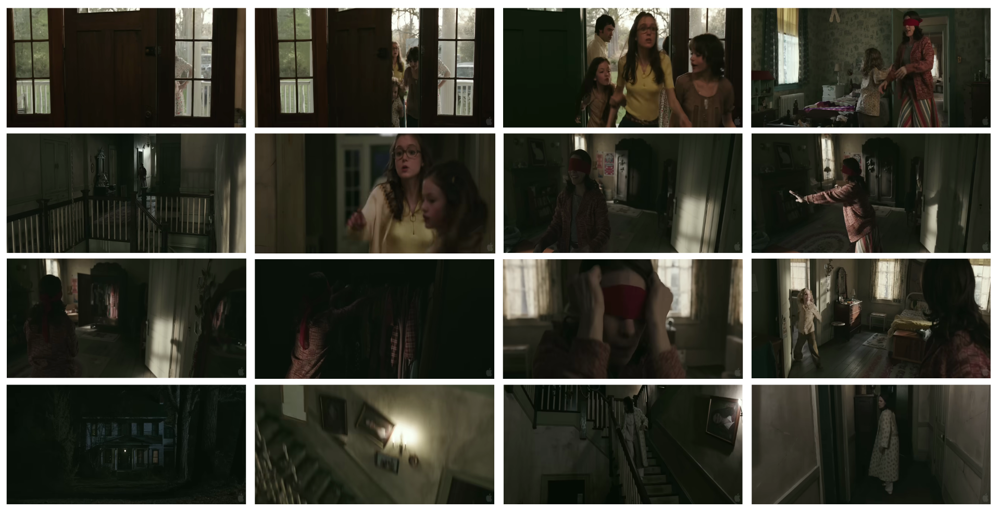
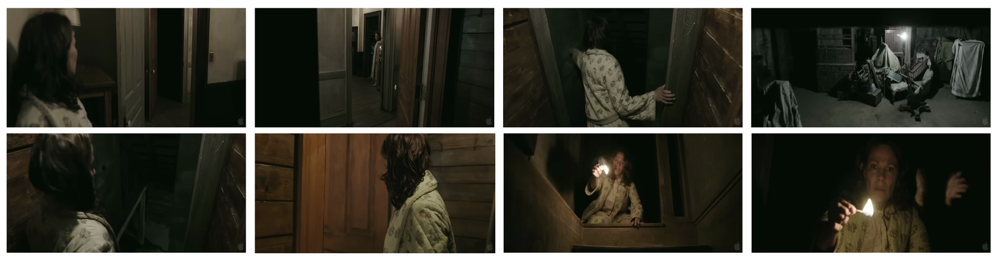
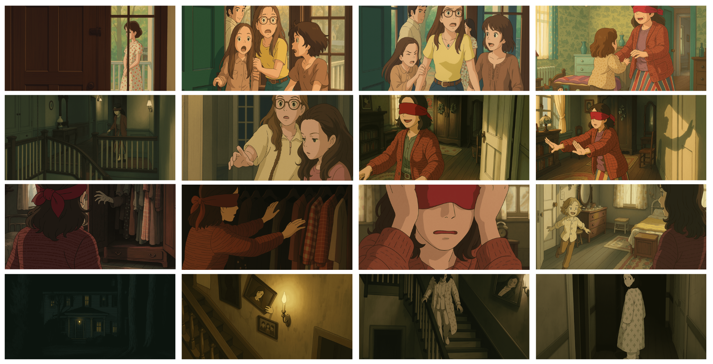
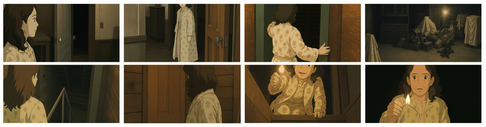
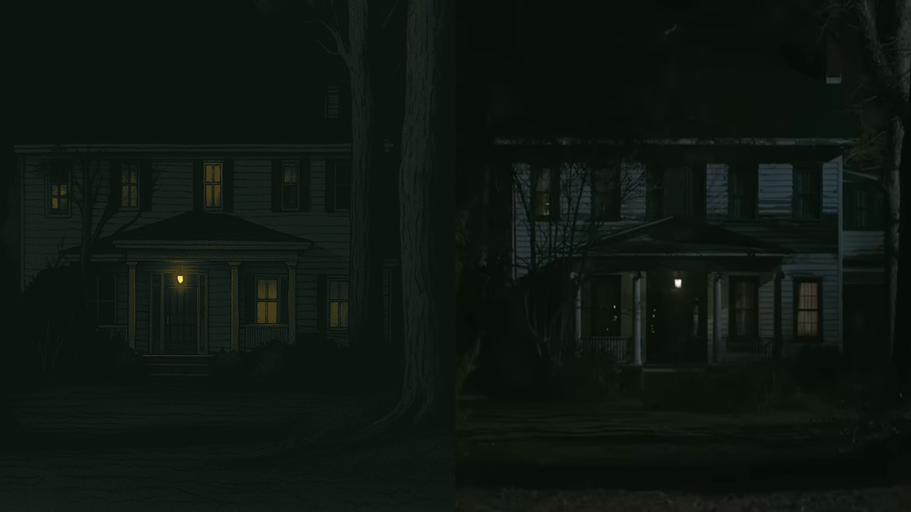

# Conjuring Ghibli Movie

Trailer of "The Conjuring" 2013 movie in a Studio Ghibli style.

This project is inspired by [PJ Ace](https://x.com/PJaccetturo/highlights) who created Lord of the Rings trailer in Studio Ghibli style.

I used some different methods to create the video.

*Audio is not included*

## Movie Introduction

“The Conjuring,” released in 2013, is a chilling supernatural horror film directed by James Wan that tells the true-inspired story of Ed and Lorraine Warren, a husband-and-wife team of paranormal investigators. When the Perron family moves into an old farmhouse in rural Rhode Island, they begin to experience terrifying, unexplained events—furniture moving on its own, strange noises in the night, and dark shadows stalking the halls. Called in to help, the Warrens uncover a malevolent spirit determined to destroy the family, and must use their faith, knowledge of the occult, and each other’s strength to banish the evil presence. The film’s tense atmosphere, memorable jump scares, and period-authentic setting made it an instant classic, launching a hugely successful horror franchise.

*This trailer was used*

## My Method

I used only 24 screenshots.

I used free version of image and video generation platforms that are Wan.video, Kling AI, and Hailuo AI.

The video is created without using a single cent.

## Screenshots used from the trailer

## Ghibli images created using the screenshots

The images were created using OpenAI's ChatGPT 4o model.

## Prompt Engineering

**Prompt for creating images**

Create a Studio Ghibli style image using the attached image.

**Some of the prompts for creating videos**

A woman walking in the corridor

A woman walking down the staircase afraid

A woman peaking inside the house from the window

**Note:** For all the prompts, it can be seen that only single action is mentioned

## Problems Faced

The video generation platforms are unable to create multiple actions in a single video frame.

Also, when specifying multiple actions in the prompt, I was not getting the desired output. After hit & trial method, I saw that I am getting a more desired output if I specified only one action.

To show what I mean, consider some examples:

Woman is looking towards the cupboard. The cupboard is opening slowly and hand is coming out of it. Hands clapped three times.

Woman is scared. Candle flame is buring. Ghostly looking hands come out form the dark and clapped three times.

In the above video, it can be seen that hand clap is not coming with other movements in the video.

## Voice

Added voice in some video clips using CapCut's AI model.

In scenrios where there are multiple faces, same lipsyncing occurs.

To listen, download the video and check.
